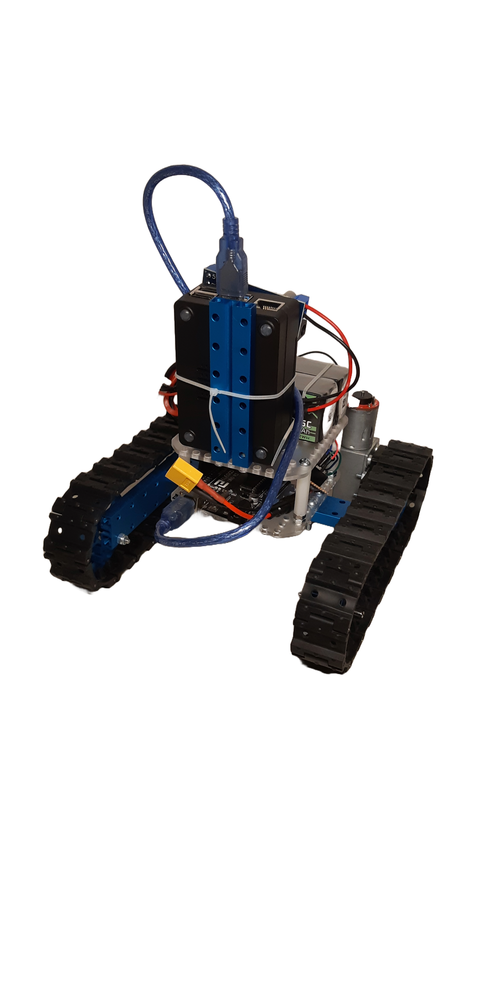

# TRIP Tracked Robot

Welcome to the DIY Mobile Robot TRIP project! This repository serves as a hub for building and testing TRIP mobile robot.

    

## Features
- **Open-Source Software**: Leverage open-source libraries and frameworks for control, navigation, and communication.
- **ROS2 Integration**: Utilize ROS2 for seamless communication, control, and coordination of your robot's components.
- **Arduino Interface**: Interface with sensors and actuators using Arduino microcontrollers, providing real-time control and feedback.
- **Testing Environment**: We plan to utilize the platform for testing various algorithms, control strategies, and sensor integrations in real-world scenarios.
- **Low Budget**: as this project is self-founded we aim to explore low cost hardware.

    

## Components
- **Raspberry pi 4 8GB RAM**
- **Arduino Uno**
- **TB6612FNG**
- 2 x **DC motor with rotary encoders** 12V gearbox ratio 150
- 2 x **LiPO Batteries** 2200mAh 11.1V 3S1P
- **Buck converter** 12V to 5V
