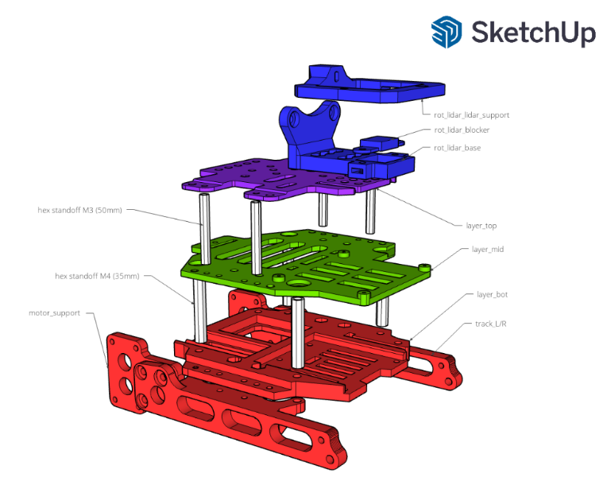

# TRIP Tracked Robot

Welcome to the TRIP Mobile Robot project! This repository serves as the central hub for building and testing TRIP, a modular, DIY tracked mobile robot. Most of its components are 3D printed, making it both accessible and customizable.

The robot is organized into three main layers:
- Layer 1: Low-level control system (Arduino and motor drivers)
- Layer 2: High-level control (Raspberry Pi 4 and batteries)
- Layer 3: Payload section — currently housing a rotating 2D LiDAR

    

## Features

- **Open-Source Software**: Leverage open-source libraries and frameworks for control, navigation, and communication.
- **ROS2 Integration**: Utilize ROS2 for seamless communication, control, and coordination of your robot's components.
- **Arduino Interface**: Interface with sensors and actuators using Arduino microcontrollers, providing real-time control and feedback.
- **Testing Platform**: We plan to utilize the platform for testing various algorithms, control strategies, and sensor integrations in real-world scenarios.
- **Low Budget**: as this project is self-founded we aim to explore low cost hardware.

    

## Related Repositories

This project is supported by multiple code repositories that handle different layers of control and functionality:

-  **Arduino Low-Level Controller**: Handles motor control and encoder feedback using an Arduino Uno.

    🔗 [MassimoClementi/TRIP-low-level-controller](https://github.com/MassimoClementi/TRIP-low-level-controller/)

- **ROS2 Interface**: A ROS2 C++ node that communicates with the Arduino via serial connection.

    🔗 [DavDori/TRIP-ROS2-cpp-serial](https://github.com/DavDori/TRIP-ROS2-cpp-serial/)

- **2D LiDAR to 3D Point Cloud Accumulator**: Accumulates rotating 2D LiDAR scans into 3D point clouds in ROS2.

    🔗 [DavDori/rotating_lidar_accumulator_ros2](https://github.com/DavDori/rotating_lidar_accumulator_ros2)

- **Rotating 2D LiDAR Control**: ROS2 node to control the stepper motor and synchronize LiDAR rotation.

    🔗 [DavDori/rotating_lidar_control_ros2](https://github.com/DavDori/rotating_lidar_control_ros2)

## Components

### Main Body

- **Structure** printable `.stl` files are available in the `models` directory of this repository.
- **Raspberry pi 4 8GB RAM** as high level controller, with Ubuntu 22.04 and ROS2 Humble.
- **Arduino Uno** as low-level controller.
- **TB6612FNG** motor driver.
- 2 x **DC motor with rotary encoders** 12V, gearbox ratio 150:1.
- 2 x **LiPO Batteries** 2200mAh 11.1V 3S1P.
- **Buck converter** 12V to 5V with USB output to power the raspberry PI 4.
- 4 x **Hex Standoff M4 > 35mm** to separate bot layer and mid layer.
- 4 x **Hex Standoff M3 > 40mm** to separate mid layer and top layer.
- **Tracks** we use makeblock tracks with wheels, but other track systems are also viable — as long as they can interface with the DC motors and the `track_r` / `track_l` 3D models.

### Rotating 2D LiDAR Module

- **DTOF FHL-LD19 Kit** 2D LiDAR
- **28BYJ-48 Stepper Motor** controls the angle of the 2D LiDAR
- **ULN2003 Driver Board** to control the stepper motor via the raspberri pi

    

## Connection Scheme

    

